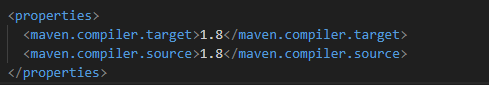

# Laboratorio2CVDS
Laboratorio 2 de Ciclos de vida del desarrollo del software

Entender apache

#### Cuál es su mayor utilidad

Capacidad para automatizar y estandarizar las dependencias y la construcción de un proyecto.

#### Fases de maven

validate: Verifica que el proyecto esté correctamente configurado.

compile: Compila el código fuente.

test: Ejecuta las pruebas unitarias.

package: Empaqueta el proyecto (por ejemplo, crea un .jar, .war, etc.).

verify: Verifica si el paquete cumple con ciertos criterios de calidad.

install: Instala el artefacto generado en el repositorio local.

deploy: Despliega el artefacto en un repositorio remoto.

#### Ciclo de vida de la construcción

default: Es el ciclo de vida principal. Las fases en este ciclo incluyen la compilación, prueba, empaquetado, instalación y despliegue del proyecto.

clean: Se utiliza para limpiar los archivos generados por una construcción anterior, como los .class y archivos temporales.

site: Genera documentación del proyecto (informes, estadísticas, etc.).

mvn install, ejecuta todas las fases anteriores antes de llegar a la fase de instalación

#### Para qué sirven los plugins

Son extensiones para realizar tareas adicionales

Compilación: Por ejemplo, el plugin maven-compiler-plugin compila el código fuente.

Pruebas: El plugin maven-surefire-plugin ejecuta las pruebas unitarias.

Empaquetado: El plugin maven-jar-plugin se usa para empaquetar el código compilado en un archivo .jar.

Generación de documentación: El plugin maven-site-plugin se utiliza para generar informes y documentación del proyecto.

Despliegue: Plugins como el maven-deploy-plugin permiten subir los artefactos a un repositorio remoto.

#### Qué es y para qué sirve el repositorio central de maven

El repositorio público de Maven es un repositorio público que contiene varias bibliotecas y dependencias de codigo abierto

Este repositorio permite:

_Gestionar dependencias_

_Evitar conflictos de versiones_

_Almacenamiento de artefactos_

## EJERCICIO DE LAS FIGURAS

### CREAR UN PROYECTO CON MAVEN

Buscar cómo se crea un proyecto maven con ayuda de los arquetipos (archetypes).

Busque cómo ejecutar desde línea de comandos el objetivo "generate" del plugin "archetype", con los siguientes parámetros:

mvn archetype:generate -DgroupId=edu.eci.cvds -DartifactId=Patterns -DarchetypeArtifactId=maven-archetype-quickstart -DarchetypeVersion=1.5 -DinteractiveMode=false -Dpackage=edu.eci.cvds.patterns.archetype

## AJUSTAR ALGUNAS CONFIGURACIONES EN EL PROYECTO

Edite el archivo pom.xml y realize la siguiente actualización:

Hay que cambiar la version del compilador de Java a la versión 8, para ello, agregue la sección properties antes de la sección de dependencias:

Para compilar ejecute el comando mvn package

..