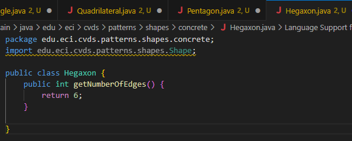

# Laboratorio2CVDS
Laboratorio 2 de Ciclos de vida del desarrollo del software

Intregantes: Santiago Hurtado, Andrés Calderon

Entender apache

#### Cuál es su mayor utilidad

Capacidad para automatizar y estandarizar las dependencias y la construcción de un proyecto.

#### Fases de maven

validate: Verifica que el proyecto esté correctamente configurado.

compile: Compila el código fuente.

test: Ejecuta las pruebas unitarias.

package: Empaqueta el proyecto (por ejemplo, crea un .jar, .war, etc.).

verify: Verifica si el paquete cumple con ciertos criterios de calidad.

install: Instala el artefacto generado en el repositorio local.

deploy: Despliega el artefacto en un repositorio remoto.

#### Ciclo de vida de la construcción

default: Es el ciclo de vida principal. Las fases en este ciclo incluyen la compilación, prueba, empaquetado, instalación y despliegue del proyecto.

clean: Se utiliza para limpiar los archivos generados por una construcción anterior, como los .class y archivos temporales.

site: Genera documentación del proyecto (informes, estadísticas, etc.).

mvn install, ejecuta todas las fases anteriores antes de llegar a la fase de instalación

#### Para qué sirven los plugins

Son extensiones para realizar tareas adicionales

Compilación: Por ejemplo, el plugin maven-compiler-plugin compila el código fuente.

Pruebas: El plugin maven-surefire-plugin ejecuta las pruebas unitarias.

Empaquetado: El plugin maven-jar-plugin se usa para empaquetar el código compilado en un archivo .jar.

Generación de documentación: El plugin maven-site-plugin se utiliza para generar informes y documentación del proyecto.

Despliegue: Plugins como el maven-deploy-plugin permiten subir los artefactos a un repositorio remoto.

#### Qué es y para qué sirve el repositorio central de maven

El repositorio público de Maven es un repositorio público que contiene varias bibliotecas y dependencias de codigo abierto

Este repositorio permite:

_Gestionar dependencias_

_Evitar conflictos de versiones_

_Almacenamiento de artefactos_

## EJERCICIO DE LAS FIGURAS

### CREAR UN PROYECTO CON MAVEN

Buscar cómo se crea un proyecto maven con ayuda de los arquetipos (archetypes).

Busque cómo ejecutar desde línea de comandos el objetivo "generate" del plugin "archetype", con los siguientes parámetros:

mvn archetype:generate -DgroupId=edu.eci.cvds -DartifactId=Patterns -DarchetypeArtifactId=maven-archetype-quickstart -DarchetypeVersion=1.5 -DinteractiveMode=false -Dpackage=edu.eci.cvds.patterns.archetype

## AJUSTAR ALGUNAS CONFIGURACIONES EN EL PROYECTO

Edite el archivo pom.xml y realize la siguiente actualización:

Hay que cambiar la version del compilador de Java a la versión 8, para ello, agregue la sección properties antes de la sección de dependencias:

Para compilar ejecute el comando mvn package

Busque cuál es el objetivo del parámetro "package" y qué otros parámetros se podrían enviar al comando mvn.

Lo que se hace al momento de poner mvn package, recorre varios ciclos de vida, como compilar el codigo fuente o compilar las pruebas. Despues de eso crea un archivo empaquetado .jar o .war para poder ser distribuido o desplegado. Este comando permite asegurarse que el codigo este listo y sea probado antes de ser mandado a produccion

Busque cómo ejecutar desde línea de comandos, un proyecto maven y verifique la salida cuando se ejecuta con la clase App.java como parámetro en "mainClass". Tip:

El comando es mvn exec:java 
Porque java es el nombre de nuestro objetivo

Realice el cambio en la clase App.java para crear un saludo personalizado, basado en los parámetros de entrada a la aplicación.

Utilizar la primera posición del parámetro que llega al método "main" para realizar elsaludo personalizado, en caso que no sea posible, se debe mantener el saludo como se encuentra actualmente:

Buscar cómo enviar parámetros al plugin "exec".

#### mvn exec:java -Dexec.mainClass="edu.eci.cvds.patterns.archetype.App" -Dexec.args="Aquí el parametro"

Ejecutar nuevamente la clase desde línea de comandos y verificar la salida: Hello World!

Ejecutar la clase desde línea de comandos enviando su nombre como parámetro y verificar la salida. Ej: Hello Pepito!

Ejecutar la clase con su nombre y apellido como parámetro. ¿Qué sucedió?

Verifique cómo enviar los parámetros de forma "compuesta" para que el saludo se realice con nombre y apellido.

#### Solo hizo falta agregar la segunda posición de args "args[1]" e incluírla en el mensaje mediante %s porque es un String

Ejecutar nuevamente y verificar la salida en consola. Ej: Hello Pepito Perez!

Cree el paquete edu.eci.cvds.patterns.shapes y el paquete edu.eci.cvds.patterns.shapes.concrete.

Cree una interfaz llamada Shape.java en el directorio src/main/java/edu/eci/cvds/patterns/shapes de la siguiente manera:

Cree una enumeración llamada RegularShapeType.java en el directorio src/main/java/edu/eci/cvds/patterns/shapes así:

En el directorio src/main/java/edu/eci/cvds/patterns/shapes/concrete cree las diferentes clases (Triangle, Quadrilateral, Pentagon, Hexagon), que implementen la interfaz creada y retornen el número correspondiente de vértices que tiene la figura.

¿Cuál fábrica hiciste? y ¿Cuál es mejor?

Nos decidimos por aplicar Simple Factory ya que la logica es muy simple y no vamos a extender mucho el proyecto.

Factory Method sería mejor que Simple Factory por su extensibilidad.

Abstract Factory sería mejor que Factory Method si se necesita crear distintos tipos(No formas) de figuras. 

Ejecute múltiples veces la clase ShapeMain, usando el plugin exec de maven con los siguientes parámetros y verifique la salida en consola para cada una:

Sin parámetros:

Parámetro: qwerty

Parámetro: pentagon

Parámetro: Hexagon

¿Cuál(es) de las anteriores instrucciones se ejecutan y funcionan correctamente y por qué?

Solo Hexagon, cuando estamos sin parametros, dice que se necesita de un parametro para funcionar, en caso de pentagon y qwrty, piden de 
que se necesita de un parametro valido, en caso de qwrty al ser letras al azar, no vuenta como parametro buscado y en pentagon, no cuenta ya que la 
primera letra debe estar en mayusculas
